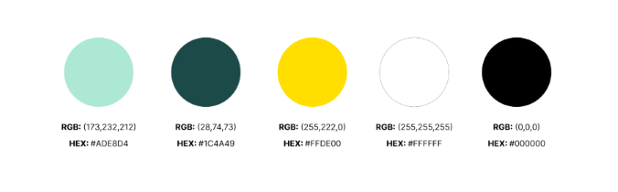
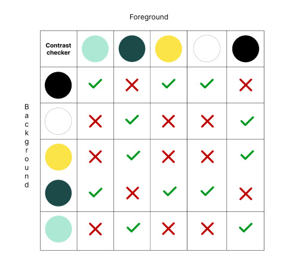
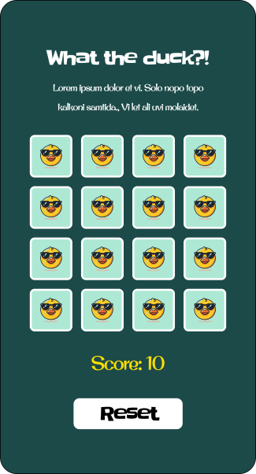
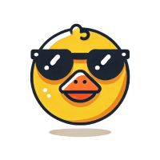
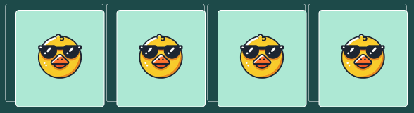

# What the duck?! - Milestone project 2 - HTML, CSS & Javascript

What the duck?! is a user-friendly memory card game designed for duck enthusiasts and casual gamers alike. Thanks to the website's full responsiveness, the game can be played on all devices. Clear instructions are provided, making it easy for users to understand how the game works and start playing right away. The game also features high-quality, vibrant and fun images of ducks, adding to the entertainment.

**Responsivity example image**

**Live site link**

## Table of contents

## UX (User Experience)

### Target audience

- Users who's looking for a game to play.

### Goals

#### External user's goals

- Have fun playing a game.

#### Site owner's goals

- Make a game that the owner would enjoy playing themselves.

### User stories

**As a site owner I want to**

- create a game that both the users and I can enjoy.
- have a user-friendly and inviting interface to increase the number of people who plays the game.

**As a user I want to**

- be able to play the game on all my devices.
- be able to find information about the game to understand how it works.
- see high quality images so that I can find matching pairs.
- have the choice to restart the game if I want to.
- see my how many moves I have done.

### Key features to meet the user goals

- To ensure the game is playable across all devices, I have implemented a mobile-first approach.
- To ensure a user-friendly and inviting interface I have implemented common design patterns ([Tidwell, Brewer & Valencia, 2020](#credits)) and selected colours and fonts to match the game theme.
- An informative text provides details about the game.
- High-quality images help users/players find matching pairs.
- A restart button that resets the game.
- A score counter tracks the number of moves made by the user.

### Wireframes

[Link to wireframes](./docs/wireframes/wireframes.md)

## Design

The overall feel of the website and game is supposed to be fun, vibrant and playful. To accomplish this, the typhography, colors and imagery are all picked based on those words.

### Typography

The fonts for the website are all from Google fonts or ,according to w3schools, safe fallback fonts.

**h1-elements and buttons**

I chose the Google font _Slackey_ since it has a playful look but is still readable. It's used for the logotype and button texts.

_Back-up font:_

As back-up font I chose Georgia and serif.

**Subheadings**

All subheadings use the Google font _Original surfer_ because it's playful yet readable.

_Back-up font:_

As back-up font I chose Verdana and sans-serif.

**p-elements**

Text elements on the website use the Google Font _Sour Gummy_. It has a playful tone while maintaining a higher level of readability, which is essential for text blocks.

_Back-up font:_

As back-up font I chose Arial and sans-serif.

### Colours

#### Colour scheme

#### Colour contrast checker

#### Mock-up

I created a quick mock-up in Figma to test the color scheme and ensure I achieved the desired result.

### Imagery

When creating the mock-up, I decided to generate icons with the help of ChatGPT to add an extra layer of playfulness and achieve the playful tone I was aiming for. I also used removebg.com to remove the backgrounds from the images.

#### The result

**Icon 1, a cool duck with sunglasses that are on the backside of the cards.**

**Icon 2, a surprised duck with sunglasses that are included in the modal when all of the cards are turned.**

## Website features

### Tablet/Mobile view

## Future Features

## Technologies used

| Source                                                                       |    Location     |             Type              | Notes                                                                 |
| ---------------------------------------------------------------------------- | :-------------: | :---------------------------: | :-------------------------------------------------------------------- |
| [WebAIM](https://webaim.org/resources/contrastchecker/)                      |     Colours     |             Tool              | Control of contrast for accesibility.                                 |
| [Gitpod](https://www.gitpod.io/)                                             |       IDE       |             Tool              | To edit code.                                                         |
| [GitHub](https://www.gitpod.io/)                                             | Version control |             Tool              | Used to create repository, version control and deployment.            |
| [Favicon.io](https://favicon.io/emoji-favicons/duck/)                        |      head       |       Favicon resource        | Get an icon in the head of the index.html file.                       |
| [Prettier](https://open-vsx.org/vscode/item?itemName=esbenp.prettier-vscode) |     README      | Markdown and markup formatter | This extension in Gitpod was used to format the README and html file. |
| [Tinify](https://tinypng.com/)                                               |     Images      |        Compress images        | This tool was used to compress images for optimization.               |
| [remove.bg](https://www.remove.bg/upload)                                    |      Icons      |             Tool              | Used to remove background on the icon 1 and 2.                        |

### Languages

The project utilizes HTML, CSS, and JavaScript to develop an interactive game environment for the web.

### Frameworks

| Source      |  Location   |    Type     | Notes       |
| ----------- | :---------: | :---------: | :---------- |
| Placeholder | Placeholder | Placeholder | Placeholder |

### Libraries

| Source                                    | Location |  Type   | Notes                                                      |
| ----------------------------------------- | :------: | :-----: | :--------------------------------------------------------- |
| [w3schools](https://www.w3schools.com/)   |  Syntax  | Library | To find solutions and syntax for HTML, CSS and JavaScript. |
| [Bootstrap](https://getbootstrap.com/)    |  Syntax  | Library | For syntac and to ensure a responsive website.             |
| [Google fonts](https://fonts.google.com/) |  Fonts   |  Tool   | Used to pick fonts for the website.                        |

### Programs

| Source                                                         |     Location     | Type | Notes                                               |
| -------------------------------------------------------------- | :--------------: | :--: | :-------------------------------------------------- |
| [Balsamiq](https://balsamiq.com/)                              |    Wireframes    | Tool | Used to create wireframes for the project.          |
| [ChatGPT](https://openai.com/)                                 |   Images, text   | Tool | Used to create images/icons and correct texts.      |
| [Figma](https://testsigma.com/blog/common-screen-resolutions/) | Colours, mock-up | Tool | Create colour scheme, contrast checker and mock-up. |

## Deployment

When the header was created, I decided to deploy the website to test the deployed version early and continously through the project to avoid surprises at the end of the project.

### Deployment steps

- Open repository in GitHub and go to settings.
- Navigate _pages_ through the menu bar to the left.
- Under _Branch_ choose main and then save.
- Go back to the <> Code tab.
- Select deployments.
- Click the provided link.

## Testing

### Validation of HTML/CSS

### Validation of JavaScript

With JS Hint

### Lighthouse audit

#### Accesibility testing

### Bugs

#### Bugs fixed

When I added the cards, they were pushed outside the intended container. This was due to Bootstraps standard padding. To solve this, I put padding: 0; to the classes flip-card and flip-card-inner.

#### Known bugs

### Browser testing

| Browser |        Layout        | functionality | ✔️ ❌ |
| ------- | :------------------: | :-----------: | :---: |
| Chrome  |          ❌          |      ❌       |
| Firefox |          ❌          |      ❌       |
| Edge    |          ❌          |      ❌       |
| Safari  | No access to Browser |       -       |

### Manual testing

|   Feature   |   Expect    |   Action    |   Result    |
| :---------: | :---------: | :---------: | :---------: |
| Placeholder | Placeholder | Placeholder | Placeholder |
| Placeholder | Placeholder | Placeholder | Placeholder |

### Manual testing: User stories

| Expectation (As a user, I want to...) | Result (As a user, I...) |
| :-----------------------------------: | :----------------------: |
|              Placeholder              |       Placeholder        |
|              Placeholder              |       Placeholder        |
|              Placeholder              |       Placeholder        |

## Credits

| Source                                                                               |     Location      |   Type   | Notes                                                                                                         |
| ------------------------------------------------------------------------------------ | :---------------: | :------: | :------------------------------------------------------------------------------------------------------------ |
| Designing Interfaces Patterns for Effective Interaction Design (2020, third edition) |    Wireframes     |   Book   | Used to choose common interface patterns to ensure a user-friendly interface and effective interactiondesign. |
| [testsigma](https://testsigma.com/blog/common-screen-resolutions/)                   | Screen resolution | Resource | Used to follow the standard/common screen resolution to ensure responsiveness to devices.                     |
