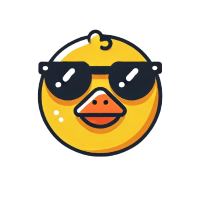
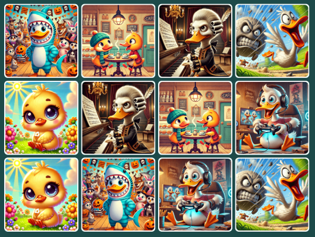
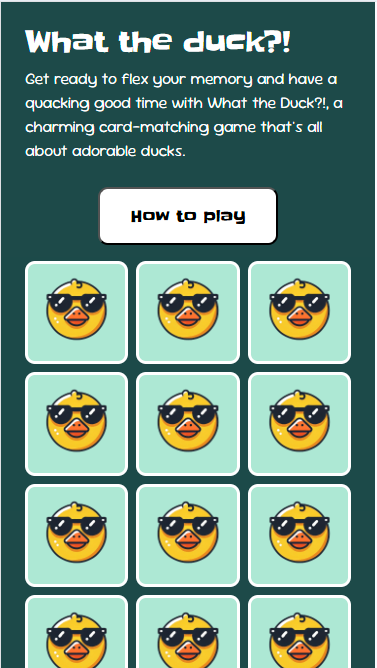
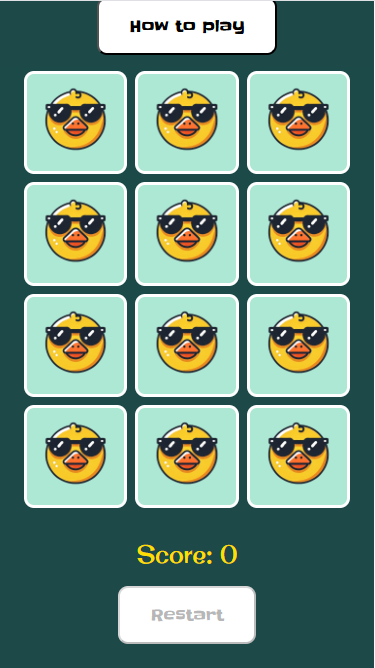
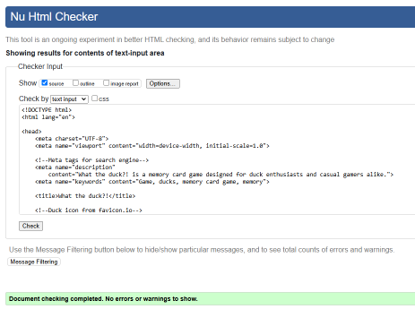
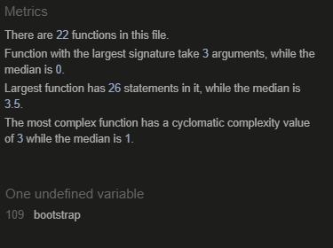
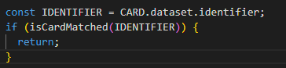

# What the duck?! - Milestone project 2 - HTML, CSS & Javascript

What the duck?! is a user-friendly memory card game designed for duck enthusiasts and casual gamers alike. Thanks to the website's full responsiveness, the game can be played on all devices. Clear instructions are provided, making it easy for users to understand how the game works and start playing right away. The game also features high-quality, vibrant and fun images of ducks, adding to the entertainment.

[Click here to visit What the duck?! website](https://tezzstrom.github.io/MS2-What-the-duck/)

## Table of contents

1. [Introduction](#what-the-duck---milestone-project-2---html-css--javascript)
2. [UX (User Experience)](#ux-user-experience)
   - [Target Audience](#target-audience)
   - [Goals](#goals)
     - [External User's Goals](#external-users-goals)
     - [Site Owner's Goals](#site-owners-goals)
   - [User Stories](#user-stories)
   - [Key Features to Meet User Goals](#key-features-to-meet-the-user-goals)
   - [Wireframes](#wireframes)
3. [Design](#design)
   - [Typography](#typography)
   - [Colours](#colours)
     - [Colour Scheme](#colour-scheme)
     - [Colour Contrast Checker](#colour-contrast-checker)
     - [Mock-Up](#mock-up)
   - [Imagery](#imagery)
4. [Website Features](#website-features)
   - [Desktop View](#desktop-view-1920x1080-resolution)
   - [Tablet/Mobile View](#tabletmobile-view)
5. [Future Features](#future-features)
6. [Technologies Used](#technologies-used)
   - [Tools and Resources](#tools-and-resources)
   - [Code Validation](#code-validation)
   - [Languages](#languages)
   - [Libraries](#libraries)
   - [Programs](#programs)
7. [Deployment](#deployment)
   - [Deployment Steps](#deployment-steps)
8. [Testing](#testing)
   - [Validation of HTML/CSS](#validation-of-htmlcss)
   - [Validation of JavaScript](#validation-of-javascript)
   - [Lighthouse Audit](#lighthouse-audit)
   - [Accessibility Testing](#accesibility-testing)
   - [Bugs](#bugs)
     - [Bugs Fixed](#bugs-fixed)
   - [Browser Testing](#browser-testing)
   - [Manual Testing](#manual-testing)
     - [Manual Testing: User Stories](#manual-testing-user-stories)
9. [Credits](#credits)

## UX (User Experience)

### Target audience

- Users who's looking for a game to play.

### Goals

#### External user's goals

- Have fun playing a game.

#### Site owner's goals

- Make a game that the owner would enjoy playing themselves.

### User stories

**As a site owner I want to**

- create a game that both the users and I can enjoy.
- have a user-friendly and inviting interface to increase the number of people who plays the game.

**As a user I want to**

- be able to play the game on all my devices.
- be able to find information about the game to understand how it works.
- see high quality images so that I can find matching pairs.
- have the choice to restart the game if I want to.
- see my how many moves I have done.

### Key features to meet the user goals

- To ensure the game is playable across all devices, I have implemented a mobile-first approach and designed the UI for different screen sizes.
- To ensure a user-friendly and inviting interface I have implemented common design patterns ([Tidwell, Brewer & Valencia, 2020](#credits)) and selected colours and fonts to match the game theme.
- An informative text provides details about the game.
- High-quality images help users/players find matching pairs.
- A restart button that resets the game.
- A score counter tracks the number of moves made by the user.
- There is a button which opens a modal with instructions on how to play the game.

### Wireframes

[Link to wireframes](./docs/wireframes/wireframes.md)

## Design

The overall feel of the website and game is supposed to be fun, vibrant and playful. To accomplish this, the typhography, colors and imagery are all picked based on those words.

### Typography

The fonts for the website are all from Google fonts or, according to w3schools, safe fallback fonts.

**h1-elements and buttons**

I chose the Google font _Slackey_ since it has a playful look but is still readable. It's used for the logotype and button texts.

_Back-up font:_

As back-up font I chose Georgia and serif.

**Subheadings**

All subheadings use the Google font _Original surfer_ because it's playful yet readable.

_Back-up font:_

As back-up font I chose Verdana and sans-serif.

**p-elements**

Text elements on the website use the Google Font _Sour Gummy_. It has a playful tone while maintaining a higher level of readability, which is essential for text blocks.

_Back-up font:_

As back-up font I chose Arial and sans-serif.

### Colours

#### Colour scheme

#### Colour contrast checker

#### Mock-up

I created a quick mock-up in Figma to test the color scheme and ensure I achieved the desired result.

### Imagery

When creating the mock-up, I decided to generate icons with the help of ChatGPT to add an extra layer of playfulness and achieve the playful tone I was aiming for. I also used removebg.com to remove the backgrounds from the images.

#### The result

**Icon 1, a cool duck with sunglasses that are on the backside of the cards.**

**Icon 2, a surprised duck with sunglasses that are included in the modal when all of the cards are turned.**

To create the images for the game, I used ChatGPT's function of rendering images. The result was colourful, vibrant images that matched overall feeling I was aiming for.

## Website features

Desktop view (1920x1080 resolution)

- To ensure the game is playable across all devices, I have implemented a mobile-first approach and designed the UI for different screen sizes.
- To ensure a user-friendly and inviting interface I have implemented common design patterns ([Tidwell, Brewer & Valencia, 2020](#credits)) and selected colours and fonts to match the game theme.

The website on different devices

- An informative text provides details about the game.

The header with the title and the introduction text to the game

- High-quality images help users/players find matching pairs.

- A restart button that resets the game.
- A score counter tracks the number of moves made by the user.

There is a restart button which resets the game and a scorecounter to count +1 everytime two cards have been turned.

- There is a button which opens a modal with instructions on how to play the game.

To read the instructions on how to play, the _How to play_ button can be clicked and a modal appears with the instructions.

### Tablet/Mobile view

Tablet view (768x1024 resolution)

Mobile view (374x667 resolution)

Bottom view on mobile version

## Future Features

- Adding appropriate alt tags for all images but that is out of my scope of knowledge at the moment.

- Future improvements could include an implementation of a highscore functionality and sound-effects to enrich the user experience.

## Technologies used

| Source                                                                       | Location        | Type                          | Notes                                                                 |
| ---------------------------------------------------------------------------- | :-------------- | :---------------------------- | :-------------------------------------------------------------------- |
| [WebAIM](https://webaim.org/resources/contrastchecker/)                      | Colours         | Tool                          | Control of contrast for accesibility.                                 |
| [Gitpod](https://www.gitpod.io/)                                             | IDE             | Tool                          | To edit code.                                                         |
| [GitHub](https://www.gitpod.io/)                                             | Version control | Tool                          | Used to create repository, version control and deployment.            |
| [Favicon.io](https://favicon.io/emoji-favicons/duck/)                        | head            | Favicon resource              | Get an icon in the head of the index.html file.                       |
| [Prettier](https://open-vsx.org/vscode/item?itemName=esbenp.prettier-vscode) | README          | Markdown and markup formatter | This extension in Gitpod was used to format the README and html file. |
| [Tinify](https://tinypng.com/)                                               | Images          | Compress images               | This tool was used to compress images for optimization.               |
| [remove.bg](https://www.remove.bg/upload)                                    | Icons           | Tool                          | Used to remove background on the icon 1 and 2.                        |

### Code validation

| Source                                                                          | Type      | Notes                                 |
| ------------------------------------------------------------------------------- | :-------- | :------------------------------------ |
| [Nu HTML checker](https://validator.w3.org/nu/)                                 | Validator | Used to validate the HTML code.       |
| [The W3C CSS Validation Service](https://jigsaw.w3.org/css-validator/validator) | Validator | Used to validate the CSS code.        |
| [JSHint](https://jshint.com/)                                                   | Validator | Used to validate the JavaScript code. |

### Languages

The project utilizes HTML, CSS, and JavaScript to develop an interactive game environment for the web.

[HTML language](https://www.w3schools.com/html/default.asp)

[CSS language](https://www.w3schools.com/css/default.asp)

[JavaScript language](https://www.w3schools.com/js/default.asp)

### Libraries

| Source                                      | Location | Type    | Notes                                                      |
| ------------------------------------------- | :------- | :------ | :--------------------------------------------------------- |
| [Bootstrap](https://getbootstrap.com/)      | Syntax   | Library | For syntac and to ensure a responsive website.             |
| [Google fonts](https://fonts.google.com/)   | Fonts    | Tool    | Used to pick fonts for the website.                        |
| [Mdn](https://developer.mozilla.org/en-US/) | Syntax   | Tool    | Find and use JavaScript syntax.                            |
| [w3schools](https://www.w3schools.com/)     | Syntax   | Library | To find solutions and syntax for HTML, CSS and JavaScript. |

### Programs

| Source                                                         | Location         | Type | Notes                                                                                                                                                                                                    |
| -------------------------------------------------------------- | :--------------- | :--- | :------------------------------------------------------------------------------------------------------------------------------------------------------------------------------------------------------- |
| [Balsamiq](https://balsamiq.com/)                              | Wireframes       | Tool | Used to create wireframes for the project.                                                                                                                                                               |
| [ChatGPT](https://openai.com/)                                 | Images, text     | Tool | Used to create images and icons, as well as refine and correct text. Also serves as a tool to make text more engaging, humorous, and vibrant. Provides guidance when internet searches are insufficient. |
| [Figma](https://testsigma.com/blog/common-screen-resolutions/) | Colours, mock-up | Tool | Create colour scheme, contrast checker and mock-up.                                                                                                                                                      |

## Deployment

When the header was created, I decided to deploy the website to test the deployed version early and continously through the project to avoid surprises at the end of the project.

### Deployment steps

- Open repository in GitHub and go to settings.

- Navigate _pages_ through the menu bar to the left.

- Under _Branch_ choose main and then save.

- Go back to the <> Code tab.

- Select deployments.

- Click the provided link.

[Link to GitHub repository](https://github.com/TezzStrom/MS2-What-the-duck)

## Testing

### Validation of HTML/CSS

#### HTML

The validator put out a warning for the h1 in the Bootstrap modal. According to the Bootstrap documentation it could be a h1 since it's consider to be a separate document but since the validator gave a warning, I decided to change it into a h2-tag instead.

#### CSS

### Validation of JavaScript

The JSHint notices an undefined variable that's connected to the Bootstrap script. This is out of my control.

### Lighthouse audit

- There are some render-blocking resources but I can't fix that with the current scope of my knowledge.

#### Accesibility testing

### Bugs

#### Bugs fixed

**Pushed cards**

When I added the cards, they were pushed outside the intended container. This was due to Bootstraps standard padding. To solve this, I put padding: 0; to the classes flip-card and flip-card-inner.

**Cards flipping back**

Clicking a card that has already been identified as a matching pair makes the first card turn.

_Chosen cards facing up (number 1 cards)_

_Clicked first card and a card that doesn't match makes the first clicked card to flip back_

I stored the matching pairs in an array and in the if statement, in the image below, control if the card is already matched which exits the function if true.

**Freeze board while cards turn back**

When the user picks two cards they could click more images to turn and that would break the game. To solve this I found a solution on [Stackoverflow(1)](#credits) which utilizes the lockboard variable and setting it to true or false.

**Bootstrap modal not showing**

When the user has matched all pairs, I wanted a modal to appear congratulating them for the win. I didn't get it to work but later found the solution in Bootstrap docs. The code solution can be seen in the image below:

### Browser testing

**Layout:** Testing layout and the appearance of the site for consistency of UI.

**Functionality:** Ensuring that there is a consistency in the functionality.

| Browser |        Layout        | functionality |
| ------- | :------------------: | :-----------: |
| Chrome  |          ✔️          |      ✔️       |
| Firefox |          ✔️          |      ✔️       |
| Edge    |          ✔️          |      ✔️       |
| Safari  | No access to Browser |       -       |

### Manual testing

| Feature            | Expect                                                                                                                       | Action                 | Result                                                                                                             |
| :----------------- | :--------------------------------------------------------------------------------------------------------------------------- | :--------------------- | :----------------------------------------------------------------------------------------------------------------- |
| Cards              | When clicking two cards the cards should turn around.                                                                        | Clicking on two cards. | The cards turns around.                                                                                            |
| Cards              | If matching pair they should stay open, otherwise they should turn back again.                                               | Clicking on two cards. | The matching pairs stay up, unmatched pairs turns back.                                                            |
| How to play button | If _How to play_ button is clicked, a modal should appear with instructions.                                                 | Clicking the button.   | From the top och the window, a modal fades in revealing instructions.                                              |
| Restart button     | If _Restart_ button is clicked, the cards that are turned should turn back and the score should reset to zero.               | Clicking the button.   | The cards resets, the card turned around turns back down. The score is set to zero.                                |
| Win modal          | When all the cards have been matched, a modal should appear with content congratulating the player to the win.               | Turning all cards.     | When the all the cards are paired, a modal appears from the top window with content that congratulates the winner. |
| Play again button  | When the _Play again!_ button is clicked, the modal should appear and the game reset with all the cards turning back around. | Clicking the button.   | The modal fades out and all the cards resets, turning back down.                                                   |

### Manual testing: User stories

| Expectation (As a site owner, I want to...)                                                      | Result (As a site owner, I...)                            |
| :----------------------------------------------------------------------------------------------- | :-------------------------------------------------------- |
| create a game that both the users and I can enjoy.                                               | have created a memory card game that the users can enjoy. |
| have a user-friendly and inviting interface to increase the number of people who plays the game. | have created a user-friendly and inviting interface.      |

| Expectation (As a user, I want to...)                                  | Result (As a user, I...)                                                 |
| :--------------------------------------------------------------------- | :----------------------------------------------------------------------- |
| be able to play the game on all my devices.                            | can play the game on all of my devices thanks to the responsiveness.     |
| be able to find information about the game to understand how it works. | can find information about the game if I press the button "How to play". |
| see high quality images so that I can find matching pairs.             | can see high quality images in the game.                                 |
| have the choice to restart the game if I want to.                      | can restart the game via the "Restart"-button.                           |
| see my how many moves I have done.                                     | can see how many moves I have done via the score counter.                |

## Credits

| Source                                                                                   | Location          | Type     | Notes                                                                                                    |
| ---------------------------------------------------------------------------------------- | :---------------- | :------- | :------------------------------------------------------------------------------------------------------- |
| Designing Interfaces Patterns for Effective Interaction Design (2020, third edition)     | Wireframes        | Book     | To choose common interface patterns to ensure a user-friendly interface and effective interactiondesign. |
| [testsigma](https://testsigma.com/blog/common-screen-resolutions/)                       | Screen resolution | Resource | Follow the standard/common screen resolution to ensure responsiveness to devices.                        |
| [CSS-tricks](https://css-tricks.com/almanac/selectors/a/attribute/)                      | data attributes   | Resource | To understand how to include a data-attribute in the css file for the flip effect.                       |
| [Stackoverflow(1)](https://shorturl.at/TOVcr)                                            | Syntax/bug        | Resource | To freeze the player's board before two pictures are flipped back.                                       |
| [Stackoverflow(2)](https://shorturl.at/U3AUw)                                            | Syntax/button     | Resource | How to add and remove disabled to the reset button.                                                      |
| [marina-ferreira.github.io](https://marina-ferreira.github.io/tutorials/js/memory-game/) | Syntax            | Resource | Shuffle function and position in JavaScript file.                                                        |
